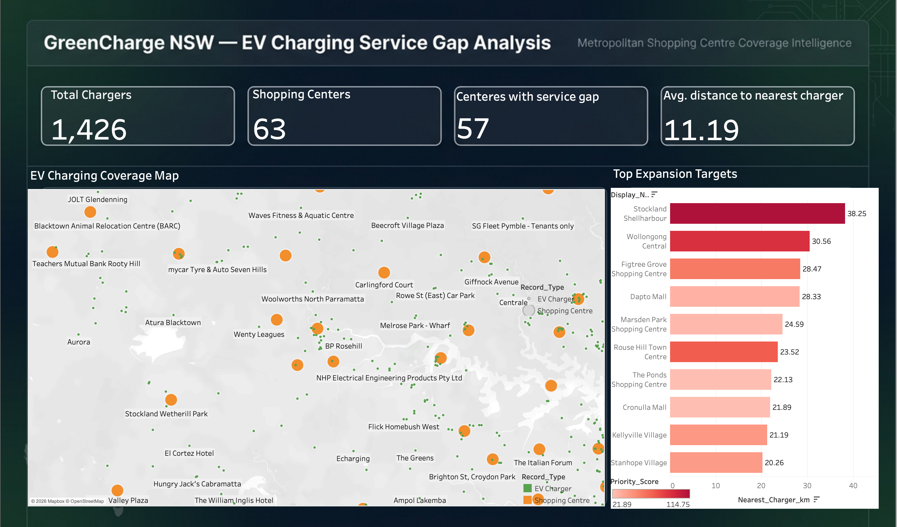

# GreenCharge NSW — EV Charging Service Gap Analysis

**A BI dashboard identifying EV charging infrastructure gaps across major NSW shopping centres, built to guide GreenCharge's network expansion and partnership outreach strategy.**

---

## Business Problem

GreenCharge, a startup focused on sustainable transport, is expanding its EV charger network across metropolitan shopping centres. The management team needed a way to identify high-traffic retail locations that currently lack sufficient charging infrastructure — so the sales team could prioritize partnership outreach effectively.

This project maps 63 major NSW shopping centres against 1,426 existing public EV chargers across the state to surface "service gaps" — busy commercial hubs with zero nearby charger coverage.

---

## Data Sources

- **EV Charging Locations** — sourced from the [Transport for NSW Open Data Hub](https://opendata.transport.nsw.gov.au/data/dataset/ev-charging-locations), an official NSW Government dataset covering destination (AC) and fast (DC) EV charging stations across the state, including planned future locations.

- **Shopping Centre Locations** — a custom dataset of 63 major Sydney-metro and NSW regional shopping centres, compiled using Google Maps location data and AI-assisted research. In addition to coordinates, size classification, and suburb information, this dataset includes computed service gap metrics — the distance from each centre to its nearest EV charger (`Nearest_Charger_km`) and a coverage flag (`Coverage_Status`) — calculated using geospatial distance analysis (Haversine formula) against the official charger dataset above.

---

## Key Findings

- **57 of 63 shopping centres (90%)** have zero EV chargers within a 2km radius
- **Average distance** from a shopping centre to the nearest charger is **11.19 km**
- The single largest gap is **Stockland Shellharbour**, sitting **38.25 km** from the nearest charger
- Top expansion priorities (weighted by centre size and distance):
  1. Stockland Shellharbour
  2. Wollongong Central
  3. Figtree Grove Shopping Centre
  4. Dapto Mall
  5. Rouse Hill Town Centre

---

## Reading the Charts

**Bar length** (x-axis) shows raw distance to the nearest charger — the primary "service gap" measure.

**Bar color** reflects the *Priority Score*, which weights distance by shopping centre size (Large centres = higher traffic potential = higher weight). This means color and length don't always agree — for example, **Rouse Hill Town Centre** appears darker red than Figtree Grove or Dapto Mall despite a *shorter* physical gap, because as a Large-format centre it represents significantly more potential charger utilization once built. The Priority Score is designed to reflect real business value, not just raw geographic distance.

**On the map**, orange markers represent shopping centres and green markers represent existing EV chargers — dense clusters of green indicate well-served areas, while isolated orange markers surrounded by empty space highlight the clearest service gaps.

---

## Recommendation

GreenCharge's sales team should prioritize partnership outreach to **Stockland Shellharbour, Wollongong Central, and Figtree Grove Shopping Centre** — all Large-format, high-traffic centres located over 28km from any existing public charger. These represent the highest-value, lowest-risk expansion opportunities based on combined traffic potential and current service gap severity.

---

## Tools & Approach

- **Tableau Desktop** — unioned both datasets, built calculated fields, interactive map, ranked bar chart, KPI dashboard, and custom visual design

**Key calculated fields (built in Tableau):**

    // Unified display name across both EV Charger and Shopping Centre records
    Display_Name = IFNULL([Station_name], [Centre_Name])

    // Classifies each row by type after unioning the two datasets
    Record_Type = IF NOT ISNULL([Centre_Name]) THEN "Shopping Centre"
                  ELSE "EV Charger"
                  END

    // Weights centre size against distance to prioritize expansion targets
    Priority_Score = (CASE [Size]
                         WHEN "Large" THEN 3
                         WHEN "Medium" THEN 2
                         WHEN "Small" THEN 1
                         ELSE 1
                       END)
                     * [Nearest_Charger_km]

---

## Repository Structure

    workbook/
        GreenCharge_EV_ServiceGap_Dashboard.twbx   <- Full interactive Tableau workbook
    data/
        ev_chargers_consolidated.csv               <- 1,426 NSW public EV charging stations
        Shopping_Centres_With_Gap_Analysis.csv     <- 63 shopping centres + computed gap metrics
    images/
        dashboard_screenshot.png                    <- Full dashboard preview
    README.md

---

## How to View This Dashboard

This project is shared as a full Tableau workbook rather than published to Tableau Public, to preserve exact formatting and custom design fidelity.

1. Download `GreenCharge_EV_ServiceGap_Dashboard.twbx` from the `workbook/` folder
2. Open it with [Tableau Desktop](https://www.tableau.com/products/desktop) or the free [Tableau Reader](https://www.tableau.com/products/reader) — no license required to view
3. All data, formatting, and the custom dashboard background are bundled inside the file — no additional setup needed

---

## About This Project

Built as a portfolio project to demonstrate end-to-end BI workflow: data sourcing, calculated field design, dashboard UX, and translating raw data into a clear, actionable business recommendation.
